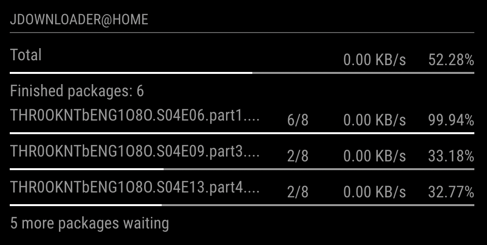

# MMM-MyJDownloader

This is a module for the [MagicMirror²](https://github.com/MichMich/MagicMirror/).

The module will connect to [MyJDownloader](https://my.jdownloader.org) and show the current status of your downloads.

## Preview



## Installation

Go to the modules folder of your mirror

```
cd ~/Magic-Mirror/modules/
```

Clone the repositories and install the dependencies

```
git clone https://github.com/osiris86/MMM-MyJDownloader.git
cd MMM-MyJDownloader
npm install
```

## Configuration

To use this module, add the following configuration block to the modules array in the `config/config.js` file:
```js
var config = {
    modules: [
        {
            module: 'MMM-MyJDownloader',
            config: {
                name: '',
                username: '',
                password: ''
            }
        }
    ]
}
```

## Configuration options

| Option           | Description
|----------------- |-----------
| `name`        | *Required* The name of your JDownloader instance, login to [https://my.jdownloader.org](https://my.jdownloader.org). In there you can see the name of your MyJDownloader instance.
| `username`        | *Required* The username that is used, to login to [https://my.jdownloader.org](https://my.jdownloader.org)
| `password`        | *Required* The password that is used, to login to [https://my.jdownloader.org](https://my.jdownloader.org)
| `updateInterval`        | *Optional* The interval in which the data is updated<br><br>**Type:** `int`(milliseconds) <br>Default 30000 milliseconds (30 seconds)
